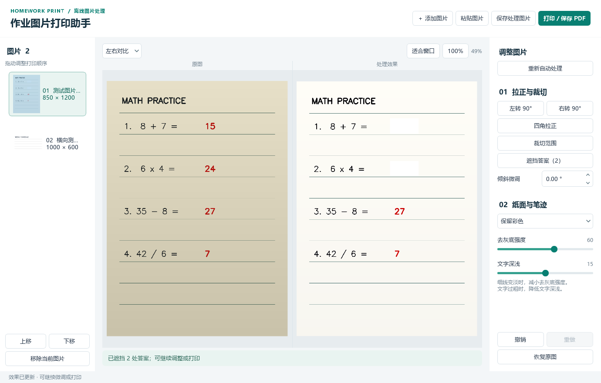
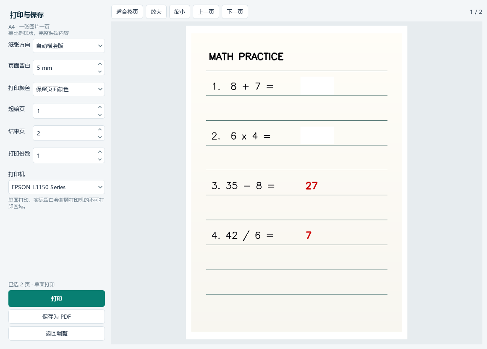
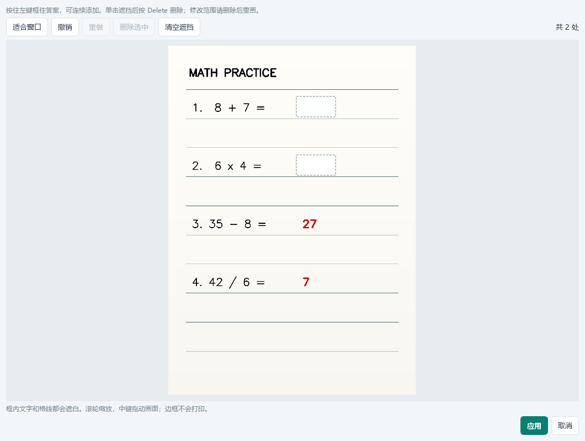

# 作业图片打印助手

把老师发来的作业照片整理成更适合打印的页面：**导入图片 → 自动去灰底和轻微纠偏 → 微调预览 → A4 打印或保存 PDF**。

面向 Windows 11 x64，中文界面，完全离线使用，不需要账号或外部 API。便携版无需安装 Python。

## 下载与使用

1. 到 [下载页面](https://github.com/erniaodoudoufei/homework-print-helper/releases/latest) 下载 Windows 便携版 ZIP。
2. 解压整个文件夹，双击 `作业图片打印助手.exe`；保留旁边的 `_internal` 文件夹。
3. 把 JPG / PNG 拖进窗口，也可以点击“添加图片”或按 Ctrl+V 粘贴。
4. 查看效果；有需要时调整四角、裁切范围、去灰底强度和文字深浅。
5. 点击“打印 / 保存 PDF”，检查预览后再选择打印或保存。

详细操作见 [中文使用说明](使用说明.txt)。

## 功能

- 多图导入、缩略图排序、移除、原图与结果对比、缩放查看。
- 自动轻微纠偏和保守纸边识别；左右旋转 90°、倾斜微调、矩形裁切、手动四角透视校正。
- 去灰底、均衡阴影、调整笔迹深浅；默认保留彩色，也可输出连续灰度黑白。
- 每张图片独立撤销、重做、恢复原图；处理从原图重新计算，原文件不覆盖。
- **遮挡答案（v1.1.0）**：连续拖出矩形盖白，支持选中删除、撤销、重做和清空；遮挡随对应内容旋转、拉正和裁切，同步用于图片、PDF 和打印。
- 后台图片处理、进度显示和取消；导出与打印使用原始分辨率。
- A4 一图一页，自动横竖版、等比例居中，默认留白 5 毫米并遵守打印机最小边距。
- 切换 Windows 打印机、页码范围和份数，记住所选打印机；保存 PNG 或多页 PDF。

使用 Windows 已安装的打印驱动，包括 EPSON L3150 Series。只有用户点击“打印”才提交任务；没有打印机也可以处理和导出。

## 界面预览

以下截图使用程序生成的测试资料。







遮挡窗口中按住左键框选，单击区域后可按 Delete 删除；滚轮缩放、中键拖动画面。点击“应用”保存本次编辑，“取消”放弃修改。框内文字、格线和背景一起遮白，编辑边框不会导出或打印。

## 适用范围

适合文字、表格和手写资料。纸边缺失或自动识别不可靠时保留范围，需手动调整四角。浅色虚线和彩色笔迹建议放大检查，必要时降低去灰底强度。

暂不包含 OCR、智能笔迹擦除、PDF 导入、扫描仪采集、拼页或弯曲书页展平；不能补出原照片未记录的内容。

## 本地开发

使用 Python 3.12 x64，在此目录运行：

```powershell
python -m venv .venv
.venv\Scripts\python.exe -m pip install -r requirements-dev.txt
.venv\Scripts\python.exe main.py
.venv\Scripts\python.exe -m pytest -q
.venv\Scripts\python.exe build_release.py
```

依赖锁定于 requirements 文件；若当前 shell 设置了禁用索引的 pip 环境变量，安装时可使用 `pip --isolated install --index-url https://pypi.org/simple -r requirements-dev.txt`。只有构建时下载依赖，应用运行不联网。

## 代码边界

- `models.py`：不可变编辑参数、每页撤销历史、打印参数。
- `processing.py`：EXIF 读取、保守纸边识别、透视/旋转/裁切、局部背景估计和彩色笔迹增强。坐标均为相应阶段图像的归一化坐标。
- `window.py` / `widgets.py`：主界面、缩略图、后台任务、四角和裁切鼠标交互。
- `whiteout.py`：矩形遮挡编辑窗口、独立撤销历史；区域保存为原图坐标，最后在处理后的像素中实心填白。
- `outputs.py`：原始分辨率处理、PNG 导出、打印页面临时缓存。
- `printing.py` / `print_dialog.py`：统一纸面排版和绘制、每页方向预览、PDF、系统打印。
- `jobs.py`：可取消后台任务。完整处理结果写入临时文件，避免多张大图同时驻留内存。

处理顺序为 EXIF → 四角透视 → 90° 旋转 → 小角度纠偏 → 矩形裁切 → 去底色 → 笔迹深浅 → 可选灰度 → 遮挡答案。预览与最终输出都从原图重新计算；历史记录只存参数。重新自动处理保留遮挡，恢复原图会清除遮挡且可撤销；所有编辑记录仅在本次会话中保留。

不使用 QPrintPreviewWidget 显示混合方向批次，因为它可能以同一个方向显示多页。自定义逐页预览与打印共用 `configure_page`、`paint_page` 和 `fit_rect`。QPrinter 采用物理页面坐标，并显式应用用户边距与硬件最小边距。

## 验证

`tests` 覆盖处理、几何、透明/EXIF/中文路径、取消、历史、UI 选择与排序、鼠标四角/裁切、PDF 页面、预览与 PDF 边界匹配、无打印机和打印触发边界。

`main.py --smoke-test <输出目录>` 是独立程序自检入口，会导入合成资料、检查历史、生成并渲染 PDF、保存界面截图和 JSON 报告。它不会向实体打印机提交任务。

软件测试包含原有 20 项及 17 项遮挡场景，覆盖区域跟随几何变换、EXIF 方向、不同分辨率、鼠标交互、历史、多图隔离、PNG 和 PDF 实际像素。发布前还会验证便携版在独立目录、移除 Python 开发环境变量后仍能运行，并通过实际鼠标操作检查遮挡窗口。实体打印效果尚未实测，需结合纸张、墨水和打印驱动实际检查。

`qa_samples.py` 可对上一级目录中的本地 JPG 做样图检查。`qa_real_ui.py` 是开发时三张特定样图的人工验收脚本，其四角坐标只存在于 QA 脚本，不会作为程序默认参数；这些原图及输出未上传。日常开发与自动测试使用合成资料，不需要这些样图。

## 打包与交付

`build_release.py` 构建 PyInstaller onedir 程序，复制说明和组件许可，运行去除开发环境变量的独立程序自检，并在上一级 `交付` 目录生成便携版 ZIP。`_internal` 必须与 exe 一起保留。Windows 中文字体使用系统已安装的微软雅黑，不随程序分发。

构建时会限制 DLL 搜索路径，避免把其他软件的同名运行库带入成品。运行 `qa_release.py` 可进一步验证 ZIP 在独立中文/空格目录解压后，移除 Python 开发环境变量仍能启动、处理和导出。当前已验证 Windows 11 x64；其他 Windows 版本尚未实测。

第三方组件及许可见 [THIRD_PARTY_NOTICES.md](THIRD_PARTY_NOTICES.md)，便携程序附带组件许可文本。

GitHub 调研参考：[ScanTailor Advanced](https://github.com/ScanTailor-Advanced/scantailor-advanced)、[NAPS2](https://github.com/cyanfish/naps2)、[noteshrink](https://github.com/mzucker/noteshrink)。本应用未复制这些项目代码，也不依赖它们的可执行文件。
